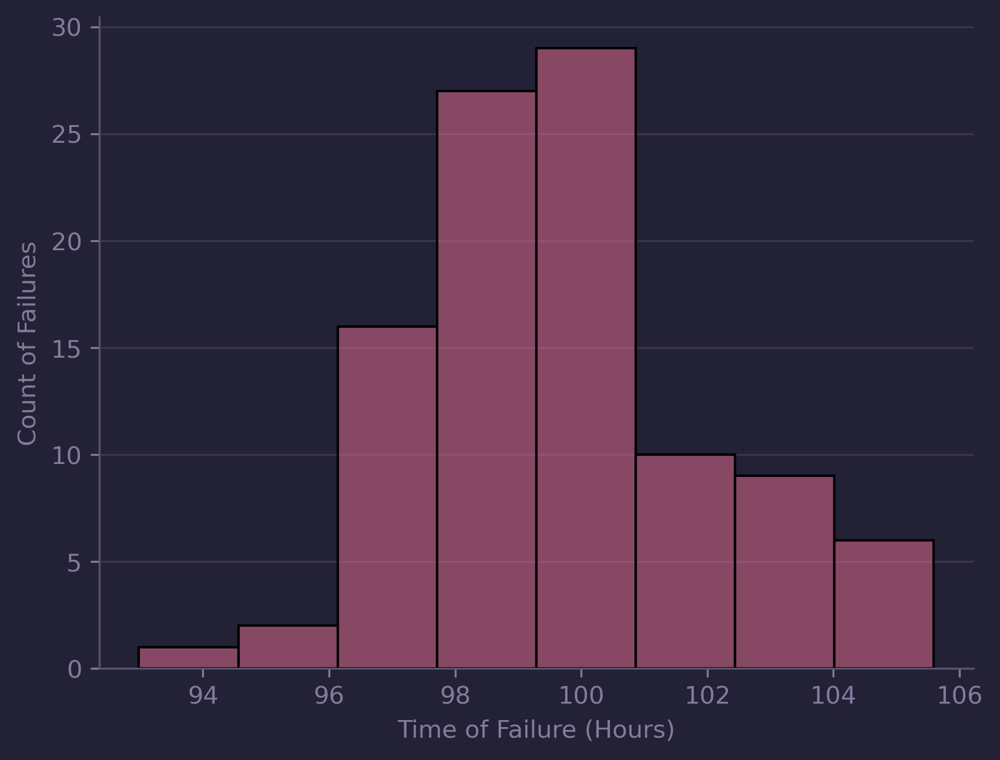

*Welcome to the first post in a series exploring the core principles of Reliability Engineering.*

*In this article, we’ll start with two essential concepts: failure rate and the reliability function. These form the foundation of how we assess and predict the performance of components over time.*

---
### What Is Failure Rate?
Ever wondered **what the likelihood is that a part fails between two points in time?**

 That’s exactly the kind of question the failure rate helps answer.

The failure rate describes the probability of failure within a given time interval. It’s typically represented using a probability density function (PDF). By plotting this function, we can understand how failures are distributed over time—and even fit a model to that distribution.

To build a PDF from real-world data, you'd start by plotting a histogram of observed failure times. On the x-axis, you have the time bins (e.g., 0–10 hours, 10–20 hours, etc.), and on the y-axis, the count of failures in each time bin. Sturges’ Rule is a handy method for deciding how many bins to use [read more here](https://en.wikipedia.org/wiki/Sturges%27s_rule).

<!-- HISTOGRAM PLOT

*Histogram of Failures* -->

{: width="400" }
*Histogram of Failures*

<!-- 
_Creating a new GitHub repo using the Chirpy Starter template_ -->

Normalizing the count of the number of failures ensures the area under the curve equals 1, allowing us to treat it as a true probability function.

<!-- NORMALIZED PLOT -->
{: width="400" }
*Normalized Histogram of Failures with KDE*

 This means we can now answer key questions like:

What’s the probability that a component fails between time a and time b?

This is calculated using a definite integral of the PDF:

$$
P (Failure\  Between\   a\  and \  b) = \int\limits_a^b f(t)dt
$$

<!-- KDE With Limits -->

{: width="400" }
*Failure Between Time A and B*

Example:
If the probability density function is given by:

$$
f(x) = \frac{x^2}{3}, -1 <x< 2
$$

Then the probability of a failure between 0 and 2 hours is:

$$
\int\limits_0^2 \frac{x^2}{3}dx =  \left[ \frac{x^3}{9} \right]_0^2 = \frac{2^3}{9} + \frac{0^3}{9} = \frac{8}{9} = 89\%

$$

So, there’s an 89% chance the part will fail during that period.

---

### Introducing the Reliability Function

The reliability function, also called the *survivor function*, answers a different but equally important question:

**What’s the probability that a part is still functioning at a certain point in time?**

Mathematically, the reliability function is defined as:

$$
R(x) = 1 -\int\limits_0^x f(x)dx
$$

In simple terms, it’s one minus the cumulative probability of failure up to time t.

{: width="400" }
*Relationship Between Failure Rate and Reliabilty*

For example, if a component has a reliability of 0.8 at 100 hours, that means there's an 80% chance it will still be operational at that time.

Going back to our earlier function, to calculate the reliability at 97 hours, we’d integrate the failure rate from 0 to 97 and subtract that value from 1.

---

*I hope this introduction has helped clarify the concepts of failure rate and the reliability function—two pillars of reliability engineering. In the next post, we’ll look at the hazard rate and how it complements these ideas in predicting component lifetimes.*

*Thanks for reading, and stay tuned!*

*Tom*